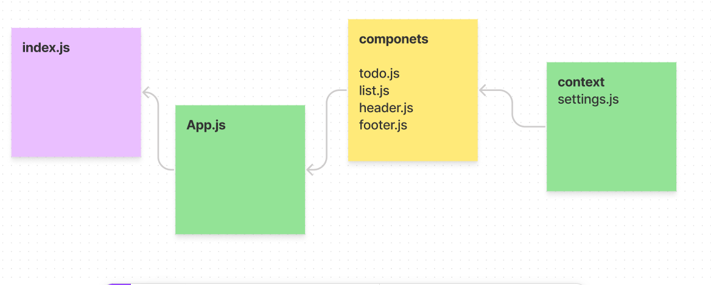

# todo-app

# LAB 31 - Context API

- me and osama we help each other to solve this lab 

## PR link :

- [PR](https://github.com/abu-nofal/todo-app/pull/2)

## Deployed link :

- [sandBox](https://m0zgc.csb.app/)

## UML :

- 